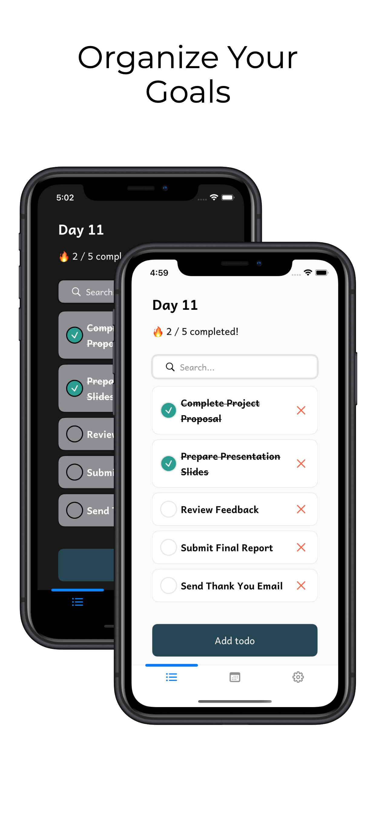
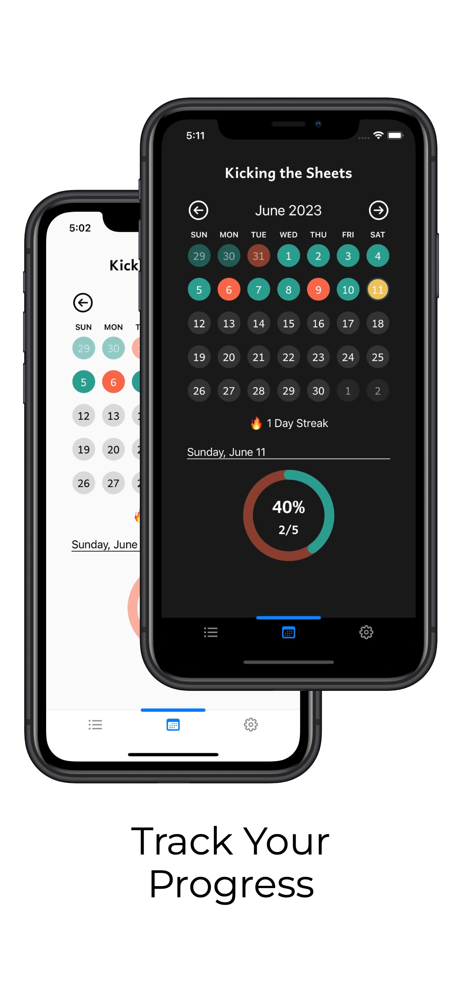

# Kicking the Sheets iOS

Kicking the Sheets is a self-hosted todo app that gamifies task completion.   

	

## About Kicking the Sheets

Kicking the Sheets aims to make task management fun and rewarding. It does this by incorporating gamification into the task completion process.

Every day you successfully complete all your tasks, you'll build up a streak, adding to your overall progress. The longer your streak, the more accomplished you'll feel, and the closer you'll get to your goals.

By incorporating gamification into task management, I aim to make productivity fun and rewarding. You'll find yourself motivated and driven to conquer your to-do list day after day.

Join me on this journey and transform the way you approach tasks. Let's turn productivity into a game and unlock your full potential!

## Why Kicking the Sheets?

This is a self-learning project.

I wanted to challenge myself to use Swift and SwiftUI to build an app that accomplished a couple of things:

- [x] Greatly improve my Swift and SwiftUI skills
- [x] Build a fully functional app that I can use daily
- [x] Publish my first app to the App Store

You will find mistakes, many mistakes, do not blame me. I guess I didn't hide them well enough.

## Screenshots

## Key Takeaways

I have learned a lot from this project. Here are some of the key takeaways:

1. SwiftUI is awesome. It's easy to learn and use, and it's fun to build UIs with it. (My day job uses UIKitf, so this gives me a chance to explore SwiftUI)
2. Don't be afraid to utilize third-party libraries. They can save you a lot of time and effort. The calendar view is a good example of this. I forked [iCalvin-Actual's calendar view](https://github.com/iCalvin-Actual/Selectable-Calendar-View) and modified it to fit my needs.
3. Take opportunities to try out different design patterns. I used the MVVM pattern for this project, and I'm glad I did. It made the codebase much more manageable and easier to maintain. (I am debating whether to try out MV or TCA for my next project)
4. Have fun! This is a personal project. Don't overthink it. Just have fun and enjoy the process.